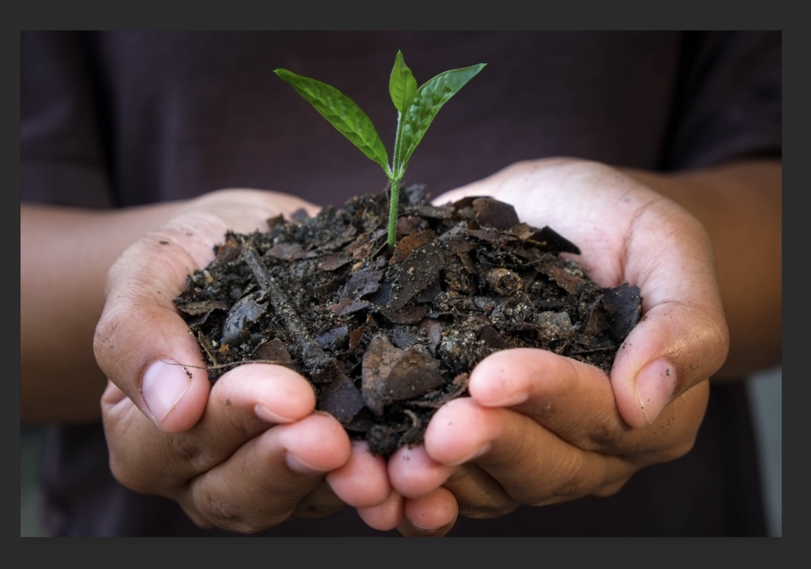

# Selected Projects

::: {.project-hero}
::: {.hero-left}
{target="_blank" rel="noopener"}
:::

::: {.hero-right}
## Biochar and Wildfire Modeling — Presentation

This project explores the effects of biochar on soil and vegetation, and models how biomass consumption influences wildfire spread using spatio-temporal statistical approaches. Click below to open the project presentation or view supporting documentation.

[Open Presentation](files/Biochar_Presentation.pdf){ .btn target="_blank" rel="noopener" }
[Download Project Document](files/Biochar_Project.pdf){ .btn .outline target="_blank" rel="noopener" }
:::
:::
