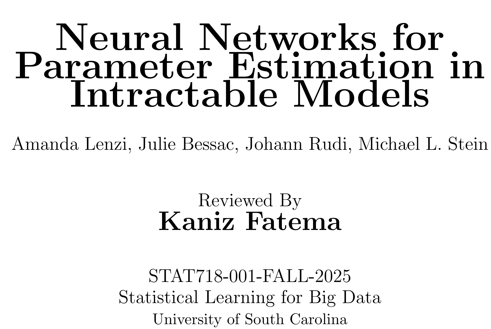

::: columns

::: column
[{width="100%"}](files/Biochar_Presentation.pdf){target="_blank" rel="noopener"}
:::

::: column

This project explores the effects of biochar on soil and vegetation, and models how biomass consumption influences wildfire spread using spatio-temporal statistical approaches. Click the buttons below to open the presentation or download the project document.

[Presentation](files/Biochar_Presentation.pdf){ .btn .outline target="_blank" rel="noopener" }  
[Project Document](files/Biochar_Project.pdf){ .btn .outline target="_blank" rel="noopener" }
:::

:::

::: columns

::: column
[{width="100%"}](files/neural.pdf){target="_blank" rel="noopener"}
:::

::: column

Neural Networks for Parameter Estimation in Intractable Models

[Presentation](files/neural.pdf){ .btn .outline target="_blank" rel="noopener" }  
:::

:::